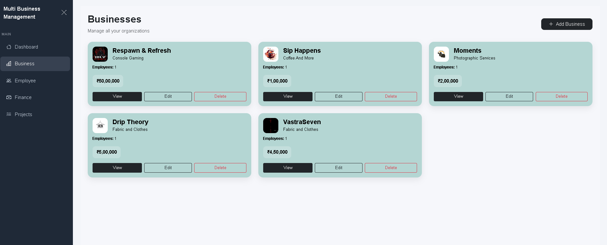
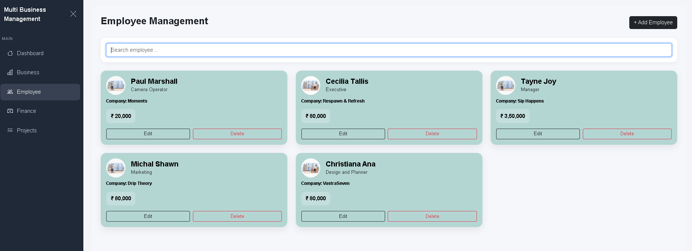
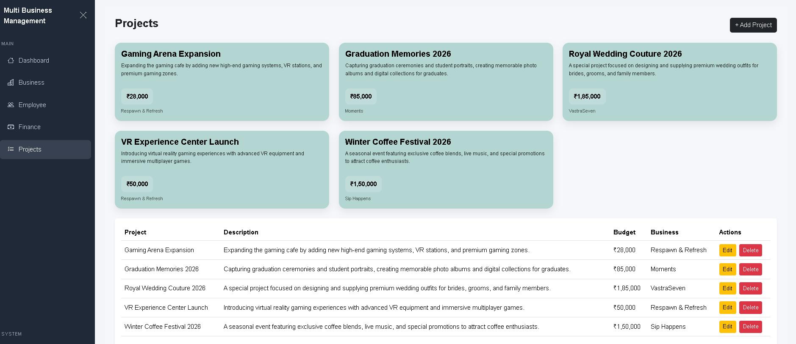
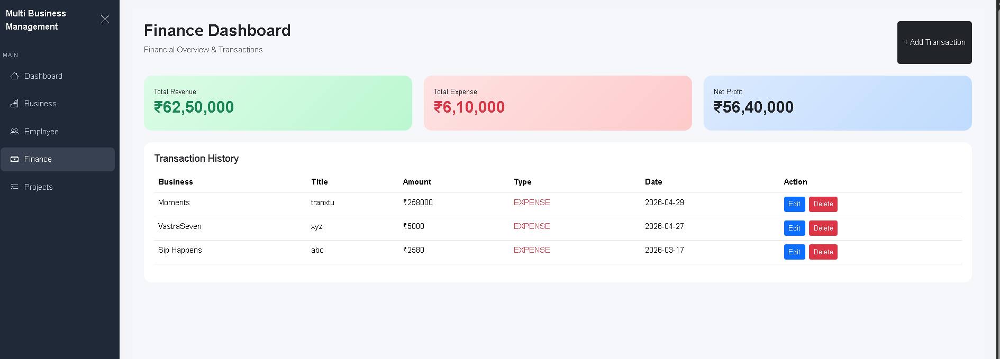

**# 🧩 MBM – Multiple Business Management System

## 📌 Project Overview

MBM (Multiple Business Management System) is a full-stack web application designed to manage multiple businesses from a single platform. The system enables users to manage businesses, employees, projects, and financial transactions while providing a centralized dashboard for monitoring business performance.

The application is built using React JS for the frontend, Spring Boot for the backend, and MySQL as the database.

---

## 🚀 Features

### 🏢 Business Management

* Add new businesses
* Update business information
* Delete businesses
* View detailed business information
* Manage multiple businesses from one platform

### 👨‍💼 Employee Management

* Add employees
* Update employee details
* Delete employees
* Assign employees to businesses
* Track employee information

### 📁 Project Management

* Create projects
* Update project information
* Delete projects
* Assign projects to businesses
* Track project budgets and progress

### 💰 Finance Management

* Record income and expenses
* Monitor business transactions
* Maintain financial records
* Analyze financial performance

### 📊 Dashboard Analytics

* Business overview
* Employee statistics
* Project statistics
* Revenue tracking
* Expense tracking
* Profit analysis

---

## 📸 Application Screenshots

### 📊 Dashboard


### 🏢 Business Management



### 👨‍💼 Employee Management



### 📁 Project Management



### 💰 Finance Management



---

## 🛠️ Tech Stack

### Frontend

* React JS
* JavaScript (ES6+)
* HTML5
* CSS3
* Bootstrap 5
* Axios

### Backend

* Java
* Spring Boot
* Spring MVC
* Spring Data JPA
* Hibernate
* REST APIs

### Database

* MySQL

### Tools & Platforms

* Git
* GitHub
* Postman
* VS Code
* IntelliJ IDEA

---

## 📁 Project Structure

### Frontend

```text
mbm-frontend/
├── public/
├── src/
│   ├── components/
│   ├── services/
│   ├── pages/
│   ├── App.js
│   └── index.js
├── images/
├── package.json
└── README.md
```

### Backend

```text
mbm-backend/
├── controller/
├── service/
├── repository/
├── entity/
├── dto/
├── config/
└── MBMApplication.java
```

---

## 🔗 REST API Modules

### Business APIs

* Create Business
* Update Business
* Delete Business
* Get Business By ID
* Get All Businesses

### Employee APIs

* Create Employee
* Update Employee
* Delete Employee
* Get Employee By ID
* Get All Employees

### Project APIs

* Create Project
* Update Project
* Delete Project
* Get Project By ID
* Get All Projects

### Finance APIs

* Create Transaction
* Update Transaction
* Delete Transaction
* Get Transaction By ID
* Get All Transactions

---

## ⚙️ Installation & Setup

### Clone Repository

```bash
git clone https://github.com/Shomaydubey23/mbm-frontend.git
```

```bash
git clone https://github.com/Shomaydubey23/mbm-backend.git
```

---

### Frontend Setup

```bash
cd mbm-frontend
npm install
npm start
```

Frontend runs on:

```text
http://localhost:3000
```

---

### Backend Setup

Configure MySQL database in:

```properties
application.properties
```

```properties
spring.datasource.url=jdbc:mysql://localhost:3306/mbm_db
spring.datasource.username=root
spring.datasource.password=your_password

spring.jpa.hibernate.ddl-auto=update
spring.jpa.show-sql=true
```

Run the Spring Boot application.

Backend runs on:

```text
http://localhost:8080
```

---

## 📊 Database

The application uses MySQL as the primary database.

Main Entities:

* Business
* Employee
* Project
* Transaction

Relationships:

* One Business → Many Employees
* One Business → Many Projects
* One Business → Many Transactions

---

## 🎯 Future Enhancements

* JWT Authentication
* Role-Based Access Control
* Email Notifications
* PDF Report Generation
* Excel Export
* Advanced Analytics Dashboard
* Cloud Deployment
* Mobile Responsive Enhancements

---

## 👨‍💻 Author

### Shomay Dubey

Full Stack Java Developer

#### Skills

* Java
* Spring Boot
* React JS
* MySQL
* REST APIs
* Bootstrap
* Git & GitHub

GitHub:
https://github.com/Shomaydubey23

---

## ⭐ Support

If you found this project useful, consider giving it a ⭐ on GitHub.
**
